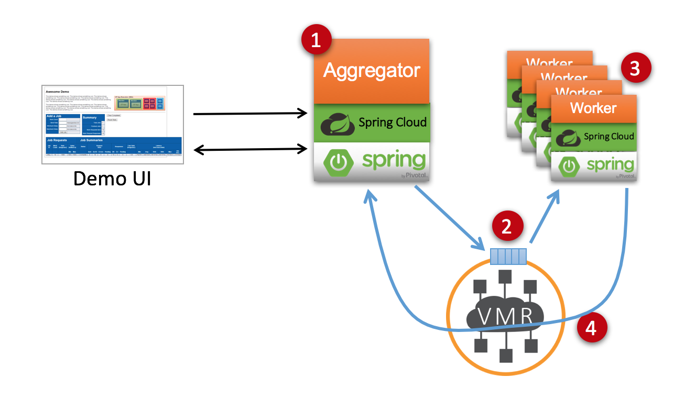
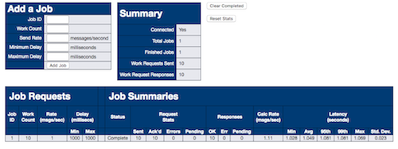

# A Demo of Messaging Based MicroServices
## Using Solace Messaging

The goal of this demo is to illustrate a real world example of using messaging between microservices in the cloud. This demo illustrates the Aggregator Microservice Design Pattern using an event driven architecture with messaging to communicate between Microservices. 

## Contents

* [Overview](#overview)
* [Running the Demo](#running-the-demo)
* [Demo Components](#demo-components)
* [Using the Demo](#using-the-demo)
* [Contributing](#contributing)
* [Authors](#authors)
* [License](#license)
* [Resources](#resources)

---

## Overview
 
TODO - Architecture diagram and explanation needs an update to reflect new app runtime.



As illustrated in the architecture diagram above, this demo is composed of the following parts:

1. A RESTful Web Application receives incoming requests. In this demo, the job requests are number of work units, rate, and delay characteristics.
2. The work requests are sent to a non-exclusive queue in the Solace Messaging Service.
3. The worker applications process messages from the Solace queue. The application can be horizontally scaled using Cloud Foundry to increase the overall processing throughput of the system.
4. When a Worker is done with a work request, it sends the response. For the purposes of this demo, the Aggregator Application tracks and displays status of each job in the summary table below.
5. The Aggregator Application and Worker Applications depend on a Solace Messaging Service for Cloud Foundry.
6. All of the apps are pushed to Cloud Foundry through the CLI or Pivotal Apps Manager.

## Running the Demo

### Project Setup

This demo depends on Solace Messaging. You need to add the connectivity details for your Solace messaging into the following two application properties:

* aggregator/src/main/resources/application.properties
* worker/src/main/resources/application.properties

For example: 

```
solace.java.host=192.168.0.50
solace.java.msgVpn=default
solace.java.clientUsername=demo 
solace.java.clientPassword=demo
```

### Building

Clone this GitHub repository and build. For example:

```
  git clone https://github.com/mdspielman/solace-messaging-demo.git
  cd solace-messaging-demo
  ./gradlew build
```

### Launch the MicroServices

You need to launch both the Aggregator and Worker application. In separate console windows, start both microservices.

#### Worker Application

```
cd solace-messaging-demo
cd worker
../gradlew bootRun
```

The worker application will startup and connect to Solace Messaging. If you see the follow output in std out, then all went well:

```
************* Solace initialized correctly!! ************
```

### Aggregator Application

```
cd solace-messaging-demo
cd aggregator
../gradlew bootRun
```

The aggregator application will startup and connect to Solace Messaging. It'll also be reachable at `localhost:8090`. If you want to use a different port, update the application.properties file as per the instructions above.
    
## Demo Components

As shown in the overview, this demo is made up of two microservice applications. Both are Spring Boot Java Applications which make use of the [solace-java-spring-boot-starter](https://github.com/SolaceLabs/solace-java-spring-boot) to auto configure Solace Messaging. The two applications are:

* Aggregator
* Worker

### Aggregator

This application is a web based application that serves a simple web page. In that web pages you can enter requests which for this demo are described as `jobs`. The application then sends the requests as messages on the Solace Messaging service and it waits and correlates the subsequent replies.

### Worker

The worker application is a Solace Messaging application that binds and listens to a Solace Non-Exclusive Queue. When it receives requests, it parses them, finds the work contents and simulates work by sleeping based on the parameters in the request. Once done it sends a correlated response back to the Solace Messaging Service to notify the Aggregator application.

## Using the Demo

### Accessing the Web UI

You can access the demo Web UI, by browsing to the Aggregator application's URL. It will be reachable at: `http://localhost:8090` if you kept the default configuration in application.

The Web UI will look similar to this:



### Adding a job

To add a new job, you fill in the web form by adding the following:

* Unique Job ID
* Work Count - This equates to number of messages to sent.
* Send Rate - How fast the Aggregator should send the messages. Sending faster than the workers can process creates a work backlog in the Solace queue. This is evident in the UI through larger than expected latency. 
* Min Delay - The lower bound for work delays. For each work message, the Aggregator will assign a random delay between the min and max.
* Max Delay - The upper bound for work delays.

### Understanding the Demo

Once a Job is added to the system, you will see it in the summary table at the bottom. Under Job Requests, the Aggregator status is reflected. The Job Summaries, provides insight into how quickly responses are coming back from the Worker Applications. If you create a scenario where the work is being sent faster than it can be produced (the send rate is faster than the min delay), the you can use the CF scale command to scale the Worker applications and increase the overall throughput of the system. This is the horizontal scaling aspect of the demo.

## Contributing

Please read [CONTRIBUTING.md](CONTRIBUTING.md) for details on our code of conduct, and the process for submitting pull requests to us.

## Authors

See the list of [contributors](https://github.com/mdspielman/solace-messaging-demo/graphs/contributors) who participated in this project.

## License

This project is licensed under the Apache License, Version 2.0. - See the [LICENSE](LICENSE) file for details.

## References

Here are some interesting links if you're new to these concepts:

* [The Solace Developer Portal](http://dev.solacesystems.com/)
* [Solace Java Spring Boot Starters](https://solace.com/blog/devops/solace-java-meet-spring-boot-starters)
* [Martin Fowler on Microservices](http://martinfowler.com/articles/microservices.html)
* [A intro to Microservices Design Patterns](http://blog.arungupta.me/microservice-design-patterns/)
* [REST vs Messaging for Microservices](http://www.slideshare.net/ewolff/rest-vs-messaging-for-microservices)
